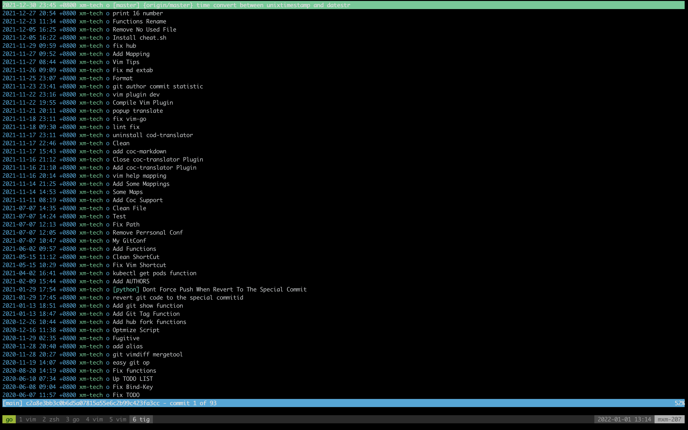

# My personal dotfiles

## overview



## Install & Usage

Precondition

```
better on mac os, or else install the external softwares & plugins manually
```

On the old machine(optional)

```shell
# generate Brewfile
brew bundle dump --force
```

On a new machine

```shell
# install all brew dependencies
brew bundle(optional)

# copy dotfiles to the appropriate places
make
```

## Introduction

```txt
# TODO
```

## Documentation

```txt
# TODO
```
