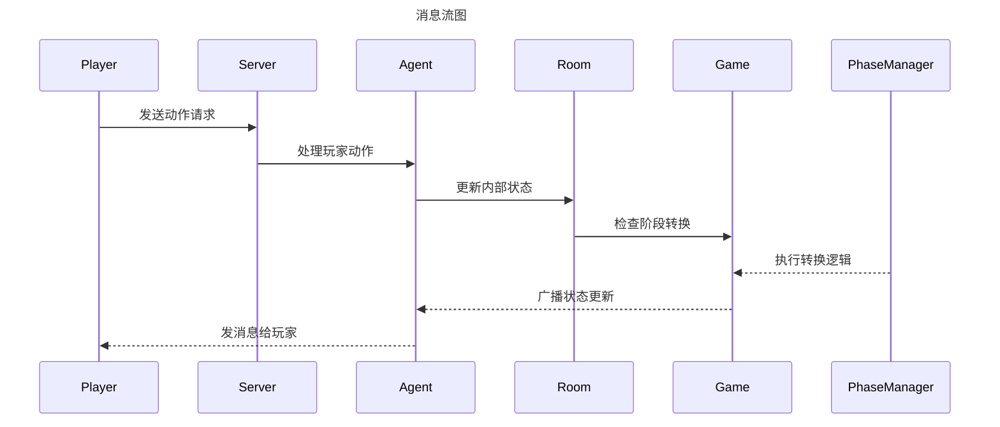
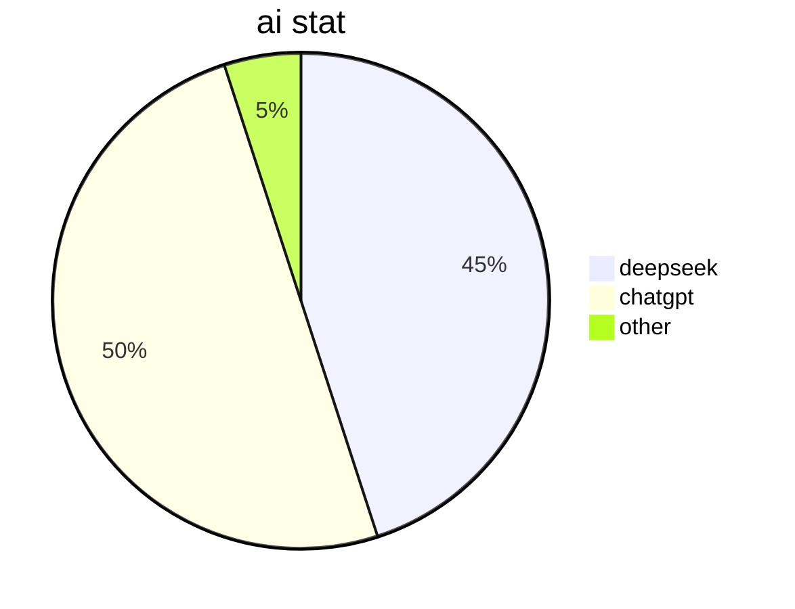
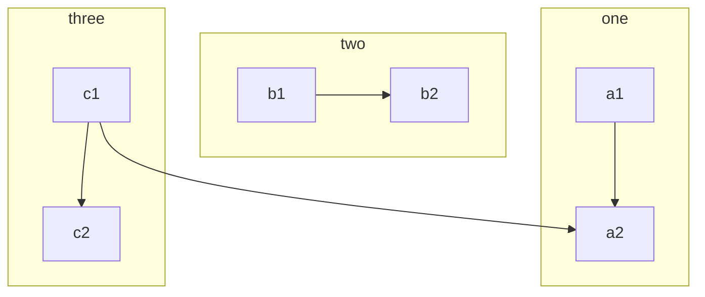
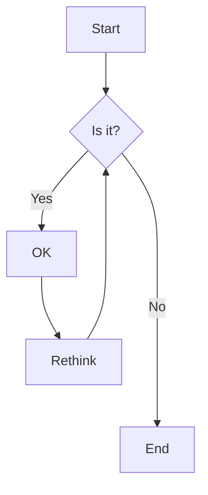
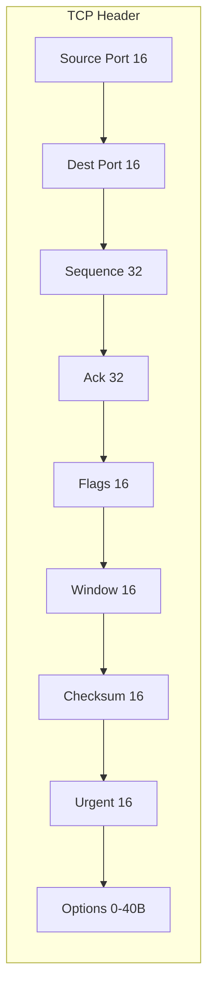

mermaid demo
==

序列图(状态转换图)
--

```mermaid

sequenceDiagram title 消息流图
    Player->>Server: 发送动作请求
    Server->>Agent: 处理玩家动作
    Agent->>Room: 更新内部状态
    Room->>Game: 检查阶段转换
    PhaseManager-->>Game: 执行转换逻辑
    Game-->>Agent: 广播状态更新
    Agent-->>Player: 发消息给玩家
```

饼图
--

```mermaid
pie title ai stat
"deepseek":45
"chatgpt":50
"other":5
```

流程图
-

```mermaid
graph TD;
    A-->B;
    A-->C;
    B-->D;
    C-->D;
```

```mermaid
flowchart TB
    c1-->a2
    subgraph one
    a1-->a2
    end
    subgraph two
    b1-->b2
    end
    subgraph three
    c1-->c2
    end
```

```mermaid
flowchart TD
    A[Start] --> B{Is it?}
    B -- Yes --> C[OK]
    C --> D[Rethink]
    D --> B
    B -- No ----> E[End]
```

```mermaid
flowchart LR
  subgraph TCP Header
    src[Source Port 16] --> dest[Dest Port 16]
    dest --> seq[Sequence 32]
    seq --> ack[Ack 32]
    ack --> flags[Flags 16]
    flags --> win[Window 16]
    win --> chk[Checksum 16]
    chk --> urg[Urgent 16]
    urg --> opt[Options 0-40B]
  end
```
